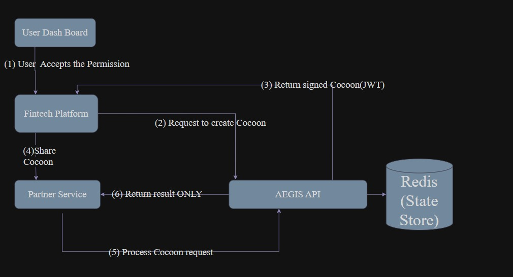

# Project Aegis: A Data Cocoon Framework for Zero-Trust Data Sharing

### Explanation

In today's FinTech ecosystem, we face a digital paradox: we must share customer data to innovate, but the moment we share it, we lose all control. This creates a "black box" where data is exposed and misused, eroding customer trust and creating massive compliance risks under regulations like India's DPDP Act.

This problem is universal and impacts every type of sensitive information. Your **transaction histories** are shared for budgeting apps, your **income data** is exposed for a simple loan verification, your **Personally Identifiable Information (PII)** is sent across multiple platforms to verify your identity, and even your **device and behavioral data** can be used in ways you never see.

Our solution, Project Aegis, handles all these scenarios with one elegant concept: we never share raw data. Instead, we wrap it in a secure, intelligent container we call a **"Data Cocoon."**

Think of this cocoon as a smart safe for data. It holds two things:
1.  The encrypted, minimal piece of information required (e.g., only income, not the full bank account details).
2.  A set of unbreakable rules (a **policy**) that dictates exactly how, when, and for what purpose that data can be used.

The data now protects **itself**, no matter where it goes. We are no longer just securing the pipes; we are securing the data itself, turning abstract legal requirements into automated, enforceable code.

*A high-level overview of the Aegis Framework, demonstrating the mediated access model.*

---

### Features that we want to build

Our hackathon prototype will be a fully functional demonstration of the Data Cocoon lifecycle, proving its versatility in handling all types of sensitive FinTech data.

* **The Aegis API & Data Cocoon Creation:** We will build a core backend service using **Python (FastAPI)**. When a user grants consent for any action, this API will generate a digitally signed **JSON Web Token (JWT)** that acts as the Data Cocoon, binding the encrypted data (e.g., a "Yes/No" income verification, an anonymized behavioral attribute, or a single transaction) and its usage policy into a tamper-proof package.
* **Trusted Processing Endpoint:** We will create a secure API endpoint where a third party must send the cocoon to use it. Our API acts as a trusted mediator: it validates the cocoon, processes the query in a secure, temporary environment, and returns **only the specific answer**, never the raw underlying data. This enforces the principle of **data minimization** by design.
* **Stateful Policy Enforcement:** We will use an in-memory database like **Redis** to track the state of each cocoon. When a partner uses a cocoon once (or its time expires), the Aegis API will update its state, rendering it unusable for any other purpose. This technically enforces access limits and data retention rules automatically.
* **Demonstration Dashboard:** We will build a simple but effective user-facing dashboard using **React** to visually showcase the end-to-end flow. It will allow judges to grant consent, view a live audit log, and witness policy violations being blocked in real-time.

---

### Features that are good to have :

Our vision for Project Aegis extends far beyond the prototype into a full-fledged platform for a safer financial internet.

* **Immediate Next Steps (Post-Hackathon):**
    * Develop official **SDKs**: Create easy-to-use Software Development Kits for Python, Node.js, and Java to make integration trivial for any FinTech company.
    * Build an **Advanced Policy Engine**: Enhance the policy engine to support more granular rules like geo-fencing or tiered permissions for different data sensitivities.
* **The Ultimate Vision (The Future of Trust):**
    * **Evolve to a Decentralized Trust Framework:** Our ultimate goal is to implement the audit and policy engine as **smart contracts on a blockchain**. This would create an immutable, publicly verifiable audit trail, moving from a system where you *trust* our API to a truly *trustless* one where you only need to trust the code. This represents the next frontier in data privacy.

---

### Constraints :

* For the hackathon prototype, we will use synthetic, mock user data covering various types (transactions, PII, etc.) for demonstration.
* Our initial proof-of-concept will utilize a simplified key management system suitable for the prototype's scope.

---

### Known issues :

* For a real-world system, the central Aegis API would need to be architected for high availability and performance to avoid becoming a bottleneck. This is a challenge our decentralized blockchain vision is designed to solve.
* The widespread adoption of the "Data Cocoon" as an industry standard would require collaboration, for which our project aims to be the catalyst.
